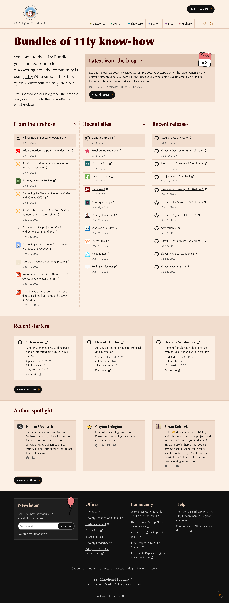

# 11tybundle.dev

## _A resource for all developers using the Eleventy static site generator_

I started this project after producing several newsletter-type blog posts on my personal website, [bobmonsour.com](https://www.bobmonsour.com). I called those blog posts [The 11ty Bundle](https://www.bobmonsour.com/tags/11ty-bundle/). I wanted to create a single place where I could share resources and information about Eleventy.

While I had already been working on some of the technical underpinnings for the site as inaccessible features on my personal site, I felt it was time to give it its own home.

As of late June 2024, you can find more than 1,100 blog posts across more than 40 [categories](https://www.11tybundle.dev/categories/) written by more than 350 [authors](https://www.11tybundle.dev/authors/).

Included in each Bundle blog post are: (1) releases of official Eleventy repos, (2) a list of blog posts recently written by a variety of authors, and (3) a list of just a few of the many sites built with Eleventy. On each page's footer, you'll also find a list of official and community resources.

I have learned, and am still learning a ton while building this project. I hope you find it useful in your work with Eleventy.

[Check it out](https://www.11tybundle.dev/) and let me know what you think. You can also grab the [RSS feed](https://www.11tybundle.dev/feed.xml) to stay up to date. If you'd prefer to receive the blog via email, [subscribe here](https://buttondown.email/11tybundle).
